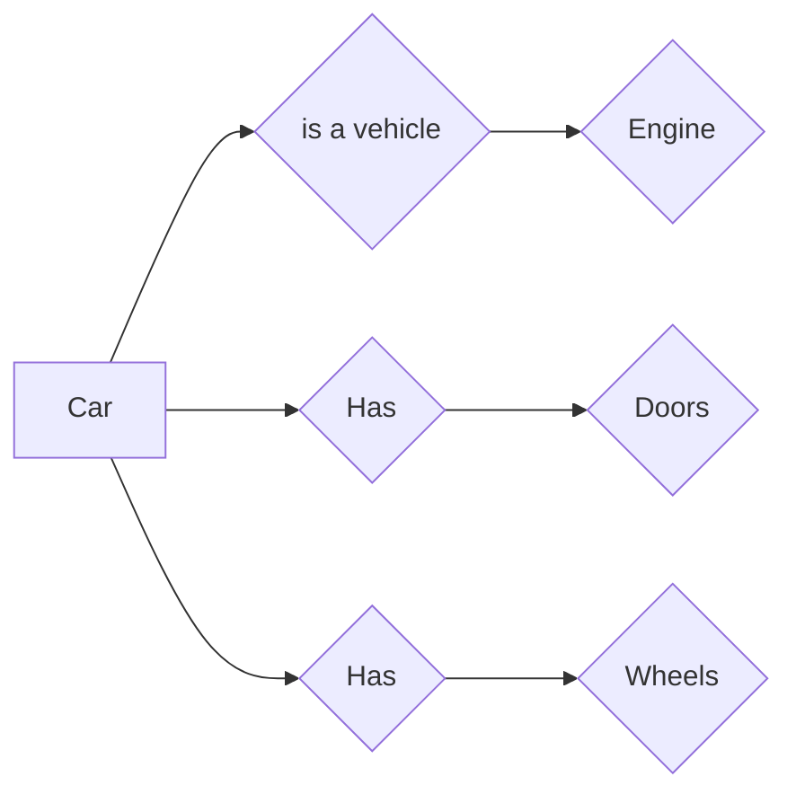
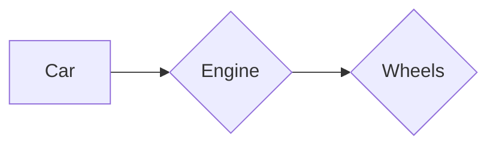
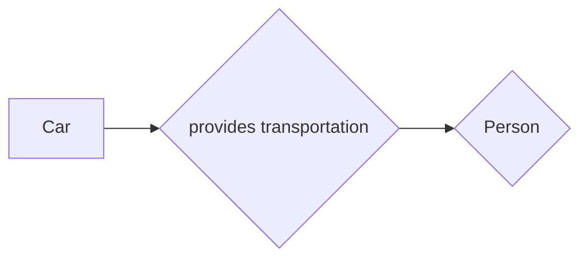

# AI


## Propositional Calculus
This defines as the statements which are either true or false. They should be anyone, These are like saying the **sky is blue**, true or false, that's it and nothing else. Like **5 is less than 10** which is true, here its confirmed.


## First order predicate calculus
This also tells true or false, but it depends upon the variable values. Like **'x' is greater than 10.** so now it depends upon the value of 'x' that if this is true or not. 


#### - Quantifiers 
These are to define the scope , to express the statement if for all or for some.
- Universal Quantifiers (∀): for all or for every
- Existential Quantifiers (∃): for some

#### - Connectives
Predicate calculus also uses logical connectives like AND (∧), OR (∨), NOT (¬), and IMPLIES (→) to combine predicates and form more complex statements.


#### - example:
Like we represent Sonu with 'S' then -
LovesMath(S) = means (S) Sonu love math.
***Sentence*** -  ∀S LovesMath(S)      ( for all S , love math)
means all Sonu loves math

 - It  solves  Propositional Calculus shortcomings as it depends on variables to tell if they are true or not.

## Horn Clause
It is specific type of rule system used in logic programming, a branch of AI used in knowledge representation and reasoning. Named after alfred horns in 1950s.
It is made of at most one positive literal(+ve statement) and any number of negative literal like if A & B are true then C is true.
***Example:*** If it barks,its a dog. Horns clause uses simplifies version of this in AI.
***Example:*** If HasFever(patient) ^ HasCough(patient) -> HasFlu(patient)
#### Benefits -
 - easier to understand
 - efficient reasoning
 - used in NLP, expert systems etc.

## Prolog
It stands for Programming in Logic, is a logical and declarative programming language specially designed for AI.
- **Declarative lang** - its not like other languages in which whole steps are written , instead facts and rules and problem is given , prolog will find the solution.
- **Logic-based** = its based on logic, means facts and rules and based on that its derives answers.
#### - Key features:-
- **Facts** = means basic statements like bird(sparrow).
- **Rule** =  anything to express and combine facts like `loves(john, X) :- loves(X, john). % If X loves John, then John loves X (rule)`
- **Queries** - ask questions based on the facts and rules you defined. like `bird(sparrow) ? - is sparrow a bird ?`
- **Unification and Backtracking**: - prologs finds the Ans based on facts and rules and if finds i , returns solution known as unification. But if doesn't then finds another possible solution known as backtracking
#### -Benfits
- easy
- good for reasoning
- flxible
#### - Applications
- Expert based systems - best as to capture and reason with human expertise in specific domain
- NLP - symbolic representation helps to understand language easier.
- rule based.


## Semantic Nets
Imagine a giant web of connection where the ideas and concepts are linked to each , that what a semantic net in AI is , a graphical representation of relationship between knowledge.
- nodes/concepts
- structure/arches/connection/.relationships

 Semantic networks are alternatives to the predicate logic for the knowledge representation technique.
benefits- 
- easy to represent and read
- related knowledge is easily clustered


## Partitioned Nets
As semantic net can get messy with complex knowledge, so partitioned nets ia like extension to it or can say to complete its shortcomings.
In this network is broken into smaller parts.
Each partition focuses on particular  view point.
Examples:





## Minskey frames
Minskey frames is a technique to represent knowledge in structured format similar to how humans understand and store information.
The data is stored in form of 'frames' and each frame has slots and those slots contains some values.
- frames = like cars
- slots = like name,model,color
- fillers= maruti,208,blue

#### benefits - 

- nlp
- flexibility
Example:
```
Frame: Restaurant 
Slot: Has menu 
- Can be filled with: Italian food menu, Sushi menu, etc. 
Slot: Has seating
 - Can be filled with: Tables, booths, etc.
Slot: Serves food
 - Can be filled with: Italian food, Sushi, etc.
Slot: Has staff
 - Can be filled with: Waiter, Chef, etc.
```
#### limitations:
- time consuming for complex
- can't capture all values


## Case Grammar Theory
It is used to understand the sentence but by going beyond just grammar, by understanding the syntactic structure or the sentence. It goes beyond subject-verb-object analysis and is used in AI.
- it focuses on what sentence want to convey.
- use in NLP to understand the meaning of sentences.
- used in question answering
- dialogue system with chatbots so that they can understand the meaning of question correctly.
#### Problems
- sometimes some words can have multiple roles


## Production Rules Knowledge Base
set of if-then instructions to tell what to do in specific condition.
Its like telling a robot on what to do if then happens.
- rules = the single instruction which is divided into 2 parts , first is condition and other is action on that condition .
- knowledge base - it is the set of instructions/rules combined together
***Example***: If red then walk.
#### Benefits
- explanable
- flexible
- easy
#### Applications
- expert systems like if this symptom then this disease
- games
- robotics
#### limitations
- complex when more rules are there


## The Inference System
Also known as inference engine which processes the information given in knowledge base and then draws a conclusion from that.
#### componants-
- knowledge base = the vast amount of data /information lib given to ai
- inference engine = which processes and draws conclusion from knowledge base.
#### Types:
- **Deductive inference-** drwas conclusion from given general rules like - if all birds fly and robin is bird then robin flys
- **inductive inference** - draws conclusion from recognizing patterns and learning from examples like seeing picture of cats with fur , thinks that all cats have fur.
#### How inference system works-
- input - given to ai like question,sensor data etc
- search - from knowledge base
- process -draws conclusion, perform deductive or inductive inference
- Output - gives answers
#### Applications
- NLP
- expert systems
- diagnosis system


## Forward & Backward Deduction.
These are inference techniques.
Forward deduction stars with data then moves to goal and backward first see the goal then checks data accordingly. Its just like a detective when first checks the clues to find the culprit is forward deduction and when detective first suspects the culprit and then finds clues according to that is backward deduction.
### Forward Deduction- 
- starts with facts and data 
- uses rules to see what conclusion can be drawn from data and facts

#### benefits-

 - best for specific goals
##### limitations
- can leave unexpected paths
- can be slow when unclear goal.

### Backward Deduction
- starts with what goal is
- check facts and rules which will lead to that goal


